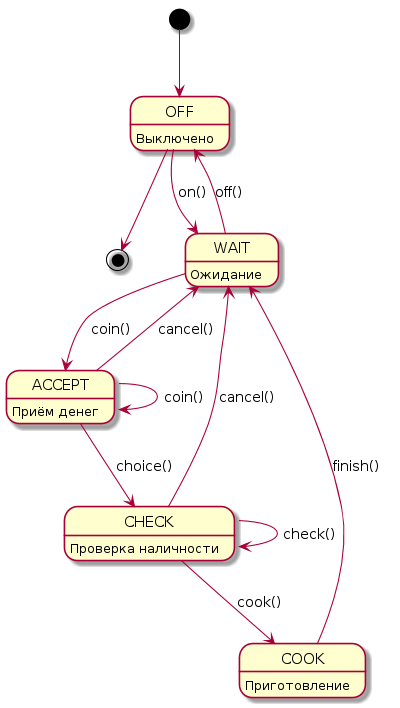

# МИПиС
## mod-lab03-coffee

Срок выполнения задания:

**до 27.03.22** 

## Lab 03. Моделирование автомата горячих напитков

## Задача №1

> Разработать класс `Automata` (автомат), являющийся упрощённой моделью автомата по продаже горячих напитков.
Изучить принцип использования автомата по продаже горячих напитков (чай, кофе, молоко и т.д.) и описать его работу в виде диаграммы состояний.

- Создать перечислимый тип `STATES` для задания состояний автомата
- Создать класс `Automata`, включить в него переменные:
  - `cash` - для хранения текущей суммы; 
  - `menu` - массив строк названий напитков (может подгружаться из файла); 
  - `prices` - массив цен напитков (соответствует массиву `menu`); 
  - `state` - текущее состояние автомата;

Включить в класс `Automata` следующие методы:

- конструктор
- `on()` - включение автомата;
- `off()` - выключение автомата;
- `coin()` - занесение денег на счёт пользователем;
- `etMenu()` - считывание меню с напитками и ценами для пользователя;
- `getState()` - считывание текущего состояния для пользователя;
- `choice()` - выбор напитка пользователем;
- `check()` - проверка наличия необходимой суммы;
- `cancel()` - отмена сеанса обслуживания пользователем;
- `cook()` - имитация процесса приготовления напитка;
- `finish()` - завершение обслуживания пользователя.

Список методов может быть изменён по желанию разработчика.

Предлагается следующая диаграмма состояний (state diagram), отражающая смену состояний и вызовы методов класса

## Задача №2

Написать программу-сценарий (без диалога) для демонстрации работы автомата.

## Задача №3

Написать модульные тесты для проверки работоспособности класса **Automata**. Необходимо обеспечить тестовое покрытие основного функционала.

## Состав проекта

- **include/Automata.h** - описание класса автомата
- **src/Automata.cpp** - реализация методов автомата
- **src/main.cpp** - сценарий использования автомата
- **test/tests.cpp** - модульные тесты
